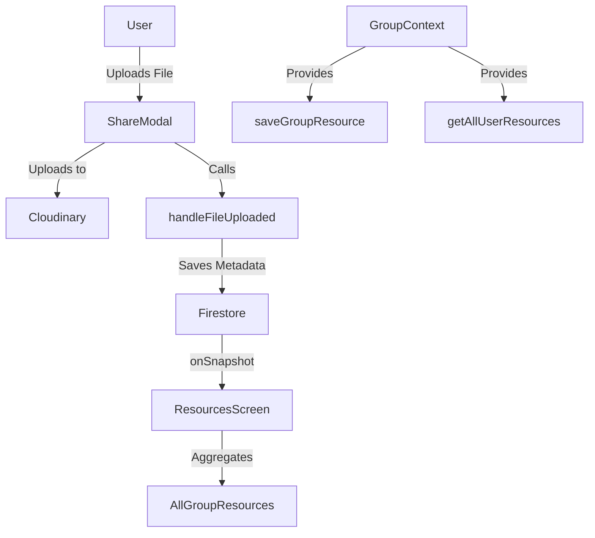

# Resources Screens Documentation

## Overview
This document provides a comprehensive technical overview of the two main resources screens in the GroupMind app:
- **Dashboard Resources Tab:** `app/(dashboard)/(tabs)/resources.tsx`
- **Group Resources Tab:** `app/(groups)/[groupId]/groupResources.tsx`

Both screens allow users to view, search, and download files (resources) uploaded to groups. The group resources tab is scoped to a single group, while the dashboard aggregates resources from all groups the user is a member of.

---

## 1. Firestore Data Structure

Resources are stored as subcollections under each group document:

```
/groups/{groupId}/resources/{resourceId}
```

Each resource document contains:
- `name`: string (file name)
- `url`: string (Cloudinary link)
- `type`: string (file type, e.g., PDF, Image)
- `uploadedBy`: string (userId)
- `uploadedByUserName`: string (user's display name)
- `uploadedAt`: timestamp
- `fileSize`: number (optional, bytes)
- `groupId`: string
- (dashboard only) `groupName`: string (for display)

---

## 2. Group Resources Tab (`groupResources.tsx`)

### **Purpose**
- Display all resources for a specific group
- Allow uploading new resources (files/images)
- Support searching/filtering
- Enable downloading and sharing files

### **Key Hooks and State**
- `useGroupContext()`: Provides user info, `saveGroupResource`, etc.
- `useLocalSearchParams()`: Gets `groupId` from route params
- `useState` for resources, search, modal visibility, etc.
- `useEffect` for Firestore listeners and fallback logic

### **Data Flow**
1. **Fetching Resources:**
   - Uses Firestore `onSnapshot` to listen to `/groups/{groupId}/resources`.
   - Updates local state in real time.
2. **Uploading Resources:**
   - User opens the ShareModal, selects a file, uploads to Cloudinary.
   - On success, `handleFileUploaded` calls `saveGroupResource` to add metadata to Firestore.
   - UI updates automatically via Firestore listener.
3. **Searching:**
   - Uses `useMemo` to filter resources by name/type/uploader.
4. **Downloading:**
   - Uses React Native `Linking` to open the file URL in the browser.

### **UI Structure**
- **Header:** Title, search toggle
- **SearchBar:** Shown when searching
- **Resource List:**
  - Card for each resource: icon, name, type, uploader, date, download/share buttons
- **Upload Button:** Opens ShareModal
- **ShareModal:** For uploading new files

### **Best Practices**
- Uses NativeWind for styling
- Handles missing `groupId` with AsyncStorage fallback
- Real-time updates via Firestore
- Defensive checks for user/groupId
- Modular, testable logic

---

## 3. Dashboard Resources Tab (`resources.tsx`)

### **Purpose**
- Aggregate and display all resources from all groups the user is a member of
- Support searching/filtering
- Enable downloading and sharing files

### **Key Hooks and State**
- `useGroupContext()`: Provides `getAllUserResources`, user info
- `useState` for resources, search, modal visibility, etc.
- `useEffect` for fetching resources

### **Data Flow**
1. **Fetching Resources:**
   - Calls `getAllUserResources(user?.uid)` from GroupContext
   - Aggregates resources from all groups
   - Adds `groupName` for display
2. **Searching:**
   - Uses `useMemo` to filter resources by name/type/uploader/group
3. **Downloading:**
   - Uses React Native `Linking` to open the file URL in the browser

### **UI Structure**
- **Header:** Title, search toggle
- **SearchBar:** Shown when searching
- **Resource List:**
  - Card for each resource: icon, name, type, uploader, group, date, download/share buttons
- **ShareModal:** For sharing existing files (not uploading)

### **Best Practices**
- Uses NativeWind for styling
- Defensive checks for user
- Aggregates and sorts resources by date
- Modular, testable logic

---

## 4. Integration with GroupContext

- **`saveGroupResource`**: Adds a resource document to Firestore
- **`getAllUserResources`**: Aggregates resources from all groups the user is a member of
- **User info**: Used for uploader metadata

---

## 5. Example Code Snippets

### **Uploading a Resource**
```tsx
const handleFileUploaded = async (fileUrl: string, fileName: string) => {
  if (!user || !groupId) return;
  await saveGroupResource({
    groupId: groupId.toString(),
    name: fileName,
    url: fileUrl,
    type: getFileType(fileName),
    uploadedBy: user.uid,
    uploadedByUserName: userInformation?.userName || "Unknown User",
    uploadedAt: Timestamp.now(),
    fileSize: 0,
  });
};
```

### **Fetching All User Resources**
```tsx
const userResources = await getAllUserResources(user?.uid);
```

### **Downloading a File**
```tsx
const handleDownload = async (resource: Resource) => {
  const supported = await Linking.canOpenURL(resource.url);
  if (supported) {
    await Linking.openURL(resource.url);
  }
};
```

---

## 6. Diagrams



---

## 7. Error Handling & Edge Cases
- Handles missing user/groupId
- Fallback to AsyncStorage for groupId
- Alerts for upload/download errors
- Real-time updates for resource changes

---

## 8. Customization & Extensibility
- Easily add new file types or icons
- Extend resource metadata as needed
- Adapt UI for new features (e.g., resource previews)

---

## 9. References
- [Firestore Subcollections](https://firebase.google.com/docs/firestore/data-model)
- [Expo FileSystem](https://docs.expo.dev/versions/latest/sdk/filesystem/)
- [NativeWind](https://www.nativewind.dev/)
- [react-native-toast-message](https://github.com/calintamas/react-native-toast-message)

---

# End of Resources Screens Documentation 