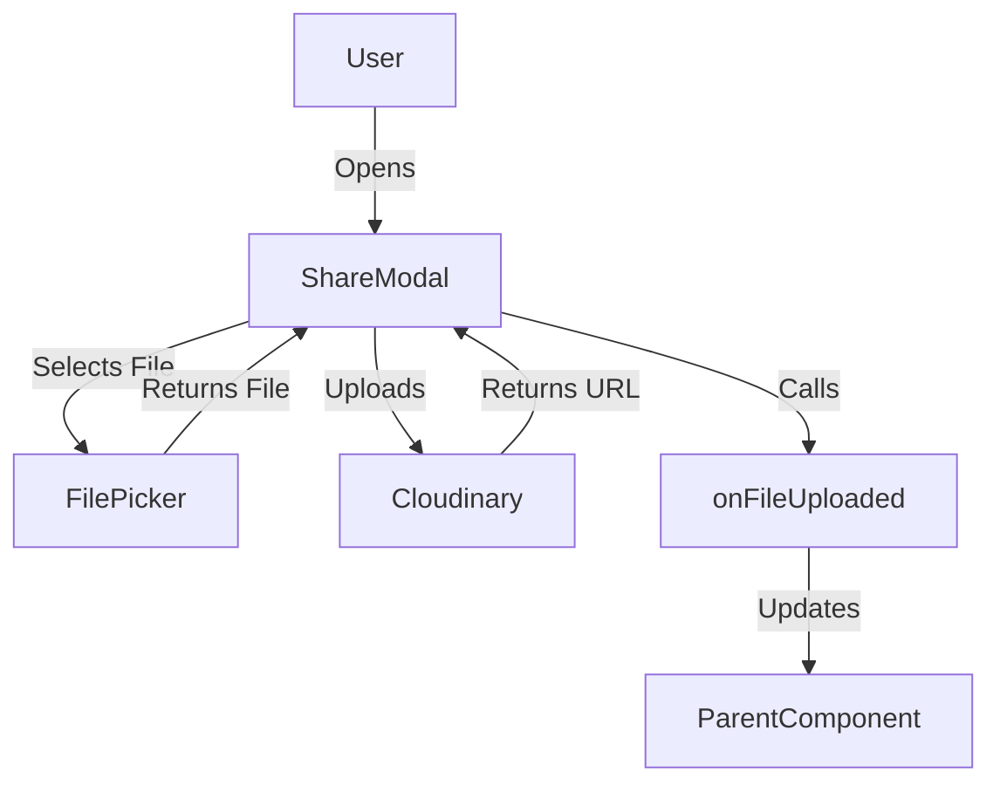

# ShareModal Component Documentation

## Overview

The `ShareModal` component is a reusable, feature-rich modal for uploading and sharing files (images, documents) in the GroupMind app. It handles file selection, preview, upload to Cloudinary, and notifies the parent component via a callback. It is used for both uploading new resources and sharing existing ones.

---

## 1. Purpose

- Allow users to select and upload files (images, documents) from their device
- Upload files to Cloudinary and return the secure URL
- Provide a preview and confirmation before upload
- Notify parent components of successful uploads via a callback
- Support both image and document file types

---

## 2. Props Interface

```ts
interface ShareModalProps {
  visible: boolean; // Controls modal visibility
  onDismiss: () => void; // Called when modal is dismissed
  onFileUploaded?: (fileUrl: string, fileName: string) => void; // Called after successful upload
}
```

---

## 3. Upload Flow

1. **User opens modal** (via upload/share button in parent)
2. **User selects file** (image or document)
3. **Preview is shown** (image or file icon)
4. **User clicks 'Send'**
5. **File is uploaded to Cloudinary**
6. **On success:**
   - Shows success alert
   - Calls `onFileUploaded(fileUrl, fileName)`
   - Dismisses modal
7. **On error:**
   - Shows error alert
   - Keeps modal open for retry

---

## 4. Cloudinary Integration

- Uses Cloudinary's unsigned upload API
- Uploads with preset and folder for organization
- Handles both images and documents
- Returns a secure URL for the uploaded file

**Example Upload Logic:**

```ts
const uploadToCloudinary = async (file) => {
  const formData = new FormData();
  formData.append("file", {
    uri: file.uri,
    type: file.mimeType,
    name: file.name,
  });
  formData.append("upload_preset", "groupmind_uploads");
  formData.append("folder", "groupmind-files");
  const response = await fetch(CLOUDINARY_URL, {
    method: "POST",
    body: formData,
  });
  const data = await response.json();
  return data.secure_url;
};
```

---

## 5. UI/UX Structure

- **Modal:** Uses `react-native-paper` Modal
- **File Selection:**
  - Image picker (images only)
  - Document picker (PDF, Word, Excel, etc.)
- **Preview:**
  - Shows image or file icon
  - Displays file name/type
- **Actions:**
  - Cancel (closes modal)
  - Send (uploads file)
- **Loading State:**
  - Disables actions during upload
  - Shows "Uploading..." text

---

## 6. Error Handling

- Alerts for upload errors
- Handles user cancellation
- Validates file selection
- Catches and logs all exceptions

---

## 7. Extensibility & Customization

- Add support for more file types by updating picker types
- Customize Cloudinary folder/preset as needed
- Extend UI for additional metadata (e.g., description)
- Add progress bar for large uploads
- Integrate with other storage providers if needed

---

## 8. Usage Example

```tsx
<ShareModal
  visible={isModalVisible}
  onDismiss={() => setIsModalVisible(false)}
  onFileUploaded={handleFileUploaded}
/>
```

**Parent Callback Example:**

```ts
const handleFileUploaded = (fileUrl, fileName) => {
  // Save to Firestore, update UI, etc.
};
```

---

## 9. Diagrams



---

## 10. Best Practices

- Always validate file type and size before upload
- Provide clear feedback for success/failure
- Use secure, unsigned Cloudinary uploads
- Keep UI responsive during upload
- Modularize for reuse in multiple contexts

---

## 11. References

- [Cloudinary Upload API](https://cloudinary.com/documentation/upload_images)
- [Expo DocumentPicker](https://docs.expo.dev/versions/latest/sdk/document-picker/)
- [react-native-paper Modal](https://callstack.github.io/react-native-paper/modal.html)

---

# End of ShareModal Component Documentation
